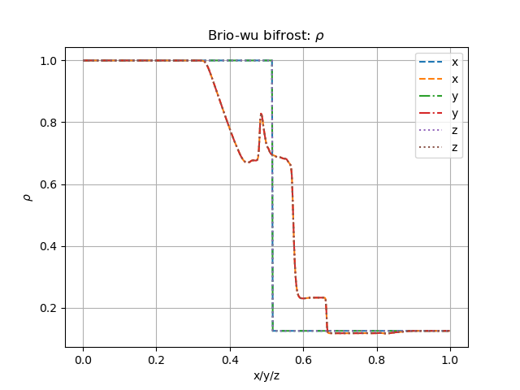

Brio& Wu experimemts 
=========================

Here we will report the results of the Brio&Wu experiment

Bifrost Solver 
---------------------
The following input parameters were used for all three directions:

+----------+----------+-----------+
| Quantity |Left state|Right state|
+==========+==========+===========+
| rho      | 1        | 0.125     |
+----------+----------+-----------+
| v_x      |  0       | 0         |
+----------+----------+-----------+
| v_y      |  0       | 0         |
+----------+----------+-----------+
| v_z      |  0       | 0         |
+----------+----------+-----------+
| P        |  1       | 0.1       |
+----------+----------+-----------+

The magnetic field values are different for the three direction, and are listed in the table below. 

           +-------------------------------------+
           |  Simulation direction               |
+----------+-------------+-----------+-----------+
|Quantity  |  x          |    y      | z         |
|          +------+------+-----+-----+-----+-----+
|          |Left  |Right |Left |Right|Left |Right|            
+----------+------+------+-----+-----+-----+-----+
| B_x      | 0.75 | 0.75 | 0   | 0   | 1   | -1  |
+----------+------+------+-----+-----+-----+-----+
| B_y      |  1   | -1   | 0.75|0.75 | 0   | 0   |
+----------+------+------+-----+-----+-----+-----+
| B_z      |  0   | 0    | 1   | -1  | 0.75| 0.75|
+----------+------+------+-----+-----+-----+-----+

The end time was: 0.1
Out time: 1e-2 

Equation of state: Gamma law, gamma=2.0 

+-----------------------------+
| Initial Bifrost Parameters: |
+=====+===+====+====+===+=====+
| Ca  | U | Uv | d  | e |   E |
+-----+---+----+----+---+-----+ 
| 0.01|0.3|0.1 | 0.5|0.5|0.9  |
+-----+---+----+----+---+-----+

Comparing densities in the x/y/z direction
------------------------------------------

The figure below shows the result of the denisties computed in each direction from the three input files

All density profiles overlap.  

different directions
different solvers

references

