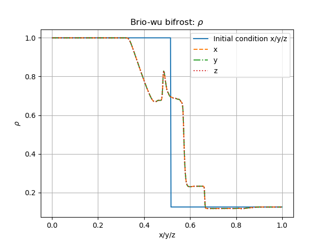
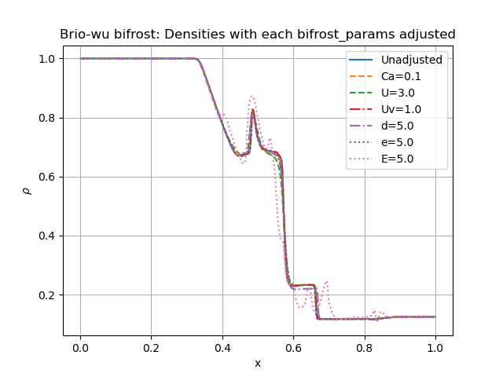
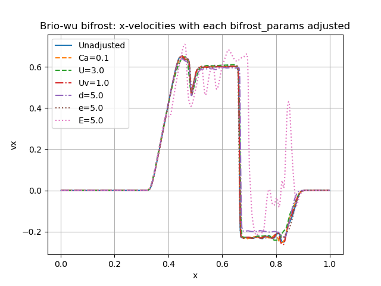

Brio& Wu experimemts 
=========================

Here we will report the results of the Brio&Wu experiment

Bifrost Solver 
---------------------
For the brio-wu experiment we use
        * gamma = 2.0
        * Final time = 0.1 
where the equation of state is a gamma law. 

Below is a table of the input parameters used for simulating the experiment in all three directions. 
These values are used in all verifications for the brio-wu experiment. 

+----------+----------+-----------+
| Quantity |Left state|Right state|
+==========+==========+===========+
| rho      | 1        | 0.125     |
+----------+----------+-----------+
| vx       |  0       | 0         |
+----------+----------+-----------+
| vy       |  0       | 0         |
+----------+----------+-----------+
| vz       |  0       | 0         |
+----------+----------+-----------+
| p        |  1       | 0.1       |
+----------+----------+-----------+

The magnetic field values are different for the three direction, and are listed in the table below. 
These will also be used in all subsequent verification tests. 

           +-------------------------------------+
           |  Simulation direction               |
+----------+-------------+-----------+-----------+
|Quantity  |  x          |    y      | z         |
|          +------+------+-----+-----+-----+-----+
|          |Left  |Right |Left |Right|Left |Right|            
+----------+------+------+-----+-----+-----+-----+
| Bx       | 0.75 | 0.75 | 0   | 0   | 1   | -1  |
+----------+------+------+-----+-----+-----+-----+
| By       |  1   | -1   | 0.75|0.75 | 0   | 0   |
+----------+------+------+-----+-----+-----+-----+
| Bz       |  0   | 0    | 1   | -1  | 0.75| 0.75|
+----------+------+------+-----+-----+-----+-----+

The initial Bifrost parameters used in the experiment are:

+-----------------------------+
| Initial Bifrost Parameters: |
+=====+===+====+====+===+=====+
| Ca  | U | Uv | d  | e |   E |
+-----+---+----+----+---+-----+ 
| 0.01|0.3|0.1 | 0.5|0.5|0.9  |
+-----+---+----+----+---+-----+

Comparing densities in the x/y/z direction
------------------------------------------

The figure below shows the result of the denisties computed in each direction from the three input files.
These were configured with the initial Bifrost Parameters listed in the above table. 

All density profiles overlap.  

Adjusting the bifrost parameters
-------------------------------
We adjust the bifrost parameters one by one while the remaining five parameters are held fixed. Each parameter are increased by a factor 10 except from E, since E=9.0 led to an error while running. In the figure below, the densities from the different runs can be seen, where the legend indicates the parameter that has been adjusted includnig its corresponding value.

Below shows the velocity in x-direction with the same parameter adjustments. 

different directions
different solvers

references

