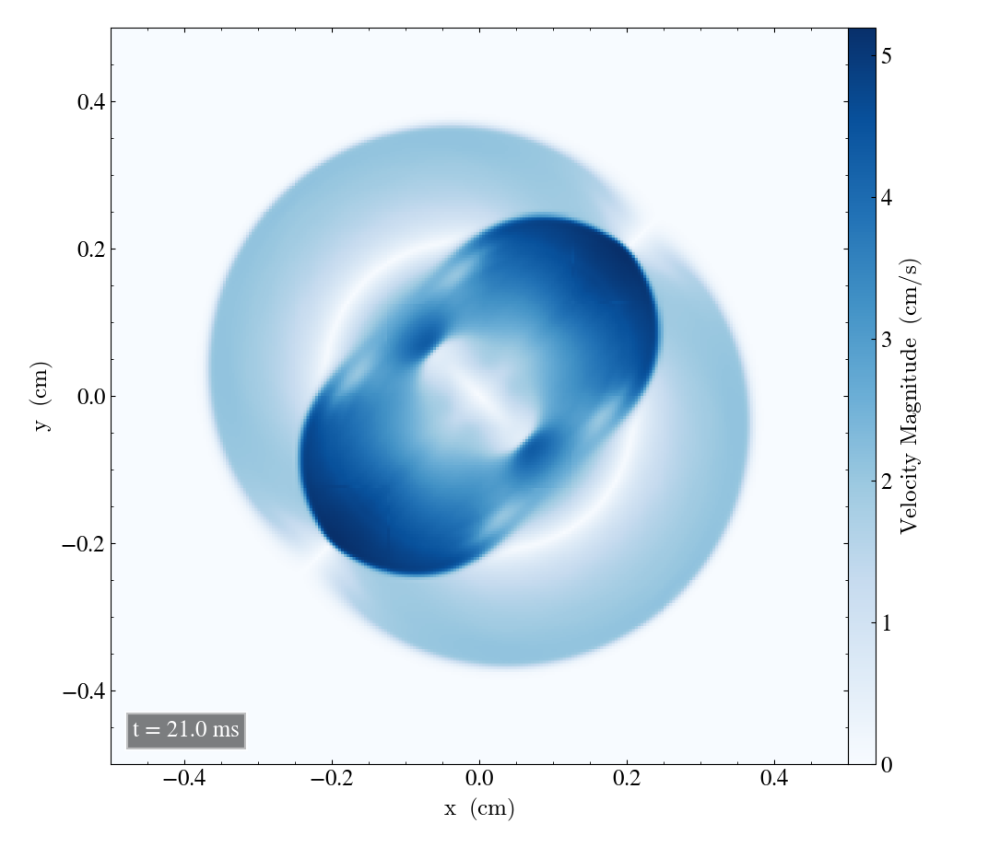

MHD Blast experiment
====================
Here we will report the results of the 2D magnetohydrodynamics experiment blast. The simulations were performed with 
 * export OMP_NUM_THREADS=4  

Experiment parameters
---------------------
In this experiment we use a gamma law equation of state with 
 * gamma = 5/3 

We use the following parameters for the experiment setup, corresponding to the inside and outside of a circle in the computational box, given in the table below   

+---------------------------------+
| experiment_params               |
+-------------+---------+---------+
| Quantity    | Inside  | Outside |
+=============+=========+=========+
| d0          | 1       |  1      | 
+-------------+---------+---------+
| p0          | 100     | 1       |
+-------------+---------+---------+
| bx0         | 7.0711  | 7.0711  |
+-------------+---------+---------+
| by0         |  7.0711 | 7.0711  |
+-------------+---------+---------+
| bz0         |   7.0711| 7.0711  |
+-------------+---------+---------+

In addition to these, the experiment_params include the case we're studying, the radius of the circle and the corrdinate of the circle center, given below. Using case=2 corresponds to the xy-plane, and we use case=3 for the xz-plane and case=4 for the yz-plane. 
 * case = 2 
 * r0 = 0.125 
 * centre=0,0,0

For the output we have 

+-----------------------------------+
|           out_params              |           
+===========+==========+============+
|  end_time | out_time | print_time |
+-----------+----------+------------+
|    0.022  |   1e-3   |     0      | 
+-----------+----------+------------+

XY-plane - case 2
-----------------
We will list the cartesian parameters and patch parameters for the simulation in the xy-direction in the two tables below. For the xz-plane, the y and z component of the parameters must be interchanged. Interchaning the x and z values yields the appropriate setup for the yz-plane. 

+------------------------------------------------------+
| cartesian_params (xy-case = 2)                       |
+==========+=======+===========+=============+=========+
|   size   |  dims |  mpi_dims |    origin   | periodic|
+----------+-------+-----------+-------------+---------+
| 1,1,0.004| 8,8,1 |   2,2,1   | -0.5,-0.5,0 |  t,t,t  |
+----------+-------+-----------+-------------+---------+

+-------------------------------------------------+
|          patch_params (xy-case = 2)             |
+=========+===============+========+==============+
|    n    |  do_check_nan |  grace | no_mans_land | 
+---------+---------------+--------+--------------+
| 32,32,1 |       t       |   0.1  |      t       |
+---------+---------------+--------+--------------+

Bifrost solver
--------------
We begin by running the experiment with the Bifrost solver. 
The tests were performed on
 * branch: develop 
 * hash: 5e8f853

The initial bifrost parameters that were used are listed in the table below. These parameters are the ones we will adjust later for verification tests. 

+------------------------------------+
|     bifrost_params:                |
+======+=====+=====+=====+=====+=====+
|  Ca  |  U  |  Uv |  d  |  e  |  E  |
+------+-----+-----+-----+-----+-----+
| 0.03 | 0.3 | 0.1 | 0.05| 0.05| 0.9 |
+------+-----+-----+-----+-----+-----+

Initial simulations for all three planes 
#########################################

We will now plot the density, energy, velocity magnitude and magnetic pressure with the initial bifrost_params unadjusted. For the density, we will include plots in the xy-plane, xz-plane and yz-plane. For the remaining quantites, we will plot in the xy-plane only. In each plot, we will include a figure of the initial configuration at t=1ms and at t=21ms.

Densities
**********

For the **xy-plane** we have 

.. image:: img_bifrost_blast/densities/density_blast_bifrost_xy_1.png
    :width: 48 %
.. image:: img_bifrost_blast/densities/density_blast_bifrost_xy_21.png
    :width: 48 %

For the **xz-plane** we get 

.. image:: img_bifrost_blast/densities/density_blast_bifrost_xz_1.png
    :width: 48 % 

Finally, for the **yz-plane** we get 

.. image:: img_bifrost_blast/densities/density_blast_bifrost_yz_1.png
    :width: 48 %
.. image:: img_bifrost_blast/densities/density_blast_bifrost_yz_21.png
    :width: 48 %

Energy
******

The energy in the **xy-plane** looks like this 

.. image:: img_bifrost_blast/ee/ee_blast_bifrost_xy_1.png
    :width: 48 %

Velocity mangnitude
*******************

The velocity magntiude in the **xy-plane** becomes 

.. image:: img_bifrost_blast/velocity_magnitude/velocity_magnitude_blast_bifrost_xy_1.png
    :width: 48 % 

Magnetic pressure
*****************

Finally, the magnetic pressure in the **xy-plane** is shown below.  

.. image:: img_bifrost_blast/magnetic_pressure/magnetic_pressure_blast_bifrost_xy_1.png
    :width: 48 %
.. image:: img_bifrost_blast/magnetic_pressure/magnetic_pressure_bifrost_xy_21.png
    :width: 48 %

