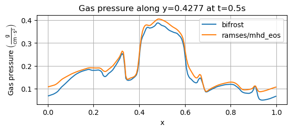
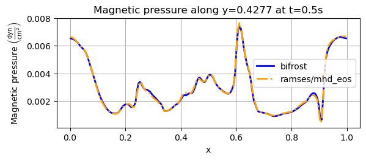

Orszag-Tang vortex
==================

Here we will report the results of the Orszag-Tang experiment. The simulations were performed with the 
 * Branch: Develop
 * Hash: 5e8f853 
 * OMP_NUM_THREADS=4

Simulation parameters
#####################

We will now report the parameters used for the simulation. For the dimensions of the simulation environment we will only report the quantities in the xy-direction, but the other two planes are configured with similar parameters, but the actual number are permutated. 

Output paramaters
*****************

For the output we have 

+----------------------------------+
| out_params                       |
+==================================+
| end_time | out_time | print_time |
+----------+----------+------------+
| 0.5      | 0.1      | 0          | 
+----------+----------+------------+

Initial conditions
******************

For the **xy-plane** we have 

+--------------------------------------------------+
| cartesian_params                                 |
+===========+=======+==========+========+==========+
| size      | dims  | mpi_dims | origin | periodic |
+-----------+-------+----------+--------+----------+
| 1,1,0.005 | 6,6,1 | 2,2,1    | 0,0,0  | t,t,t    |
+-----------+-------+----------+--------+----------+

+----------------------------------------------------+
| patch_params                                       |
+====+=========+==============+==============+=======+
| nt | n       | no_mans_land | do_check_nan | grace |
+----+---------+--------------+--------------+-------+
| 5  | 32,32,1 | t            | t            | 0.1   |
+----+---------+--------------+--------------+-------+

+-----------+
| IC_params |
+===========+
| idirect   | 
+-----------+
| 3         |
+-----------+

For the **xz-plane** the simulation was run by interchanging the second and third value of size, dims, mpi_dims and n, while the **yz-plane** was simulated by interchanging the first and thrid value of the same parameters. For the **xz-plane** we used idirect=2 for the IC_params, while idirect=1 corresponded to the **yz-plane**.

Solver parameters
#################

For the gas, we used a **gamma-law** equation of state with 
 * gamma=5/3 

Bifrost parameters
******************

For the bifrost solver we used 

+--------------------------------------+
| bifrost_params                       |
+======+=====+=====+======+======+=====+
| Ca   | U   | Uv  | d    | e    | E   | 
+------+-----+-----+------+------+-----+
| 0.03 | 0.1 | 0.1 | 0.05 | 0.30 | 0.3 |
+------+-----+-----+------+------+-----+

+--------------------------------------+
| stagger_params                       |
+======+=====+=====+======+======+=====+
| cs   | pa  | ofd | mas  |  kap | eta | 
+------+-----+-----+------+------+-----+
| 0.10 | 1.0 | 1.0 | 0.0  |  1.0 | 1.0 | 
+------+-----+-----+------+------+-----+

Ramses parameters
*****************

For the ramses solver, we used 
 * slope_type=3.5

Bifrost results 2D
##########################

Here we will show the results of the experiment compiled with the bifrost solver. There are four quantities we will report for three different planes, namely density, energy, velocity magnitude and magnetic pressure.

We will plot the final states of the different quantities in all three directions. We will also include a plot of the initial state at t=0s for the xy-direction only. The plot at t=0s for the xy plane will be shown in the upper left panel, while the upper right panel shows the plot in the xy-plane after t=0.5s. The lower left and lower bottom corresponds to the xz-plane and yz-plane at t=0.5s respectively. 

Density
*******

We begin with the density, shown below.  

.. image:: img_ot_bifrost/density_ot_bifrost_xy_0.png
   :width: 48 % 

.. image:: img_ot_bifrost/density_ot_bifrost_yz_5.png
   :width: 48 % 

Energy
******

We proceed with the energy, shown below

.. image:: img_ot_bifrost/ee_ot_bifrost_xy_5.png
   :width: 48 % 
.. image:: img_ot_bifrost/ee_ot_bifrost_xz_5.png 
   :width: 48 % 
.. image:: img_ot_bifrost/ee_ot_bifrost_yz_5.png 
   :width: 48 %

Velocity magnitude
******************

Below are the images of the velocity magnitude

.. image:: img_ot_bifrost/velocity_magnitude_ot_bifrost_xy_0.png
   :width: 48 % 
.. image:: img_ot_bifrost/velocity_magnitude_ot_bifrost_xy_5.png
   :width: 48 % 
.. image:: img_ot_bifrost/velocity_magnitude_ot_bifrost_xz_5.png 
   :width: 48 % 

Magnetic pressure
*****************

Finally, we plot the magnetic pressure

.. image:: img_ot_bifrost/magnetic_pressure_ot_bifrost_xy_0.png
   :width: 48 % 

.. image:: img_ot_bifrost/magnetic_pressure_ot_bifrost_yz_5.png 
   :width: 48 %

Ramses results 2D
#########################

We will now report the results obtained compiled with the ramses/mhd_eos solver, where we plot the same quantities as we did for the bifrost solver. 

The plots are the same as we did with bifrost, where each quantity is shown for the xy-plane, xz-plane and yz-plane. For the xy-plane we will include the result at t=0s, but for all three directions we will report the result after t=0.5s. Similarly to the bifrost plots, the upper left and upper right plots corresponds to the xy-plane at t=0s and t=0.5s repsectively. The lower left and lower right plots correspond to the xz-plane and yz-plane, respectively.  

Density
*******

We begin with the density, shown below.  

.. image:: img_ot_ramses/density_ot_ramses_xy_0.png
   :width: 48 % 
.. image:: img_ot_ramses/density_ot_ramses_xy_5.png
   :width: 48 % 

.. image:: img_ot_ramses/density_ot_ramses_yz_5.png 
   :width: 48 %

Energy
******

Then we plot the energy, shown below

.. image:: img_ot_ramses/ee_ot_ramses_xy_0.png
   :width: 48 % 

.. image:: img_ot_ramses/ee_ot_ramses_xz_5.png 
   :width: 48 % 

Velocity magnitude
******************

The resulting velocity magnitude is shown below

.. image:: img_ot_ramses/velocity_magnitude_ot_ramses_xy_0.png
   :width: 48 % 

.. image:: img_ot_ramses/velocity_magnitude_ot_ramses_xz_5.png 
   :width: 48 % 
.. image:: img_ot_ramses/velocity_magnitude_ot_ramses_yz_5.png 
   :width: 48 %

Magnetic pressure
*****************

Finally, we plot the magnetic pressure, shown below.

.. image:: img_ot_ramses/magnetic_pressure_ot_ramses_yz_5.png 
   :width: 48 %

1D pressure line profiles
##############################

We will now report the results of the gas pressure and magnetic pressure along the x-axis for the xy-plane.

Gas pressure
************

We start with the gas pressure, derived from the gamma law equation of state, taken at t=0.5s at y=0.4277. The results from the bifrost solver and the ramses/mhd_eos solver is shown in the plot below.

For the above image, we get an overall profile for both solvers, matching the one from Miniati & Martin (2011). Their simulation was performed with a grid of 200x200 cells. For the bifrost solver, the maximum gas pressure lies below 0.4 g/(cm*s^2), matching the result of Miniati & Martin. Their simulation also has P<0.1 at the boundaries where x=0 and x=1, similar to the bifrost solver. The shape of their resulting pressure at 0.9 < x < 1 looks more or less identical to the one obtained with the bifrost solver.  

We also compare the above result to Ryu et. al. (1998), which used the same y-value of y=0.4277, a grid of 256x256 cells and an output time of t=0.48s. In that experiment, the pressure had a slightly higher local maximum near x=0.2 and a less fluctuating profile near this point. The sudden increase in pressure before x reaches 0.4 that we see above does not occur in the result of Ryu et. al. (1998) before x reaches approximately x=0.44. Their overall maximum pressure value is slighlty larger than P=0.4, and resembles the shape we obtained from the ramses/mhd_eos solver. For x>0.9 Ryu et. al. lies below P=0.1 and reaches a final value of P=0.8. 

As a final comparison, we consider the result from Stone et. al. (2008) where a 192x192 computational grid was used with a final time of t=0.5, both used for the above image as well. Their results were obtained with a slice along y=0.427. The pressure obtained by Stone et. al. starts below P=0.1, and reaches P=0.2 approximately around x=0.3. The steep pressure increase near x=0.4 above seems to occur almost exactly at x=0.4 in Stone et. al., which is at a slightly higher x-value than we have. The maximum pressure value they reach seems to be just below P=0.4. The small peak near x=0.9 lies above P=0.1 in Stone et. al. and approaches a final value in the range P= 0.07-0.08.       

Now, we plot the gas pressure for the same experiment with a slice along y=0.3125, shown below. 

The above plot corresponds to an experiment by Stone et. al. (2008). Both initial values above resemble the initial values from Stone et. al. very well. The profile we see from the bifrost solver corresponds well with Stone et. al., but the drop that occurs before x=0.1, where the pressure drops below P=0.2 g/(cm*s^2) is less abrupt than it is in Stone et. al., where the drop has a minimum value of around P=0.13 g/(cm*s^2). The increase after x=0.2 from the ramses/mhd_eos solver is greater than in Stone et. al., and the bifrost matches this level better. The pressure drop around x=0.3 from the bifrost solver coincides well with Stone et. al., while the ramses/mhd_eos yields a too high pressure at this point. From that point and towards x=0.7, the bifrost results look very similar to Stone et. al. The bifrost solver also matches Stone et. al. for the remaining x-values, all the way towards x=1.  

Magnetic pressure
*****************

For the magnetic pressure, we will only consider a slice along y=0.4277, shown below, which was reported by Ryu et. al. (1998) and Miniati & Martin (2011). 

Above, we see that the bifrost and ramses/mhd_eos solvers yield more or less the same result. Compared to Miniati & Martin the initial magnetic pressure above is initially lower, with their initial value is around 0.0085. Then, there is overlapping results until we rach the point x=0.2. The peak occuring before x=0.3 in Miniati & Martin. yields a magnetic pressure higher than 0.004. The two peaks we see around x=0.5 is approximately the same value as the peak before x=0.3 in Miniati & Martin, and their also roughly the same size in their experiment. The maximum value near x=0.6 yields a Magntic pressure around 0.01 in Miniati & Martin, much higher than what is plotted above. The reminaing simulation resembles Miniati & Martin well, but their pressure drops to approximately 0 around x=0.9, lower than our result and they reach a final value of the magnetic pressure that is above 0.008, while the above results lie below 0.007.

In Ryu et. al. the initial and final pressure lies around 0.009. The peak between x=0.2 and x=0.3 exceeds 0.004 in their experiment as well. The two peaks around x=0.5 lies below 0.004 in Ryu et. al. and has a lower value than we have obtained. These peaks are thus lower than the one around x=0.25. The increment around x=0.6 reaches a value of 0.009 in Ryu et. al., while we don't exceed 0.008 with our simulation. Around x=0.9, the pressure in Ryu et. al. drops to a value near zero, lower than our minimum value, before it reaches the end value around 0.009   

References
----------

 * Miniati & Martin (2011) - https://iopscience.iop.org/article/10.1088/0067-0049/195/1/5/pdf
 * Ryu et. al. (1998) - https://iopscience.iop.org/article/10.1086/306481/pdf
 * Stone et. al. (2008) - https://iopscience.iop.org/article/10.1086/588755/pdf 
