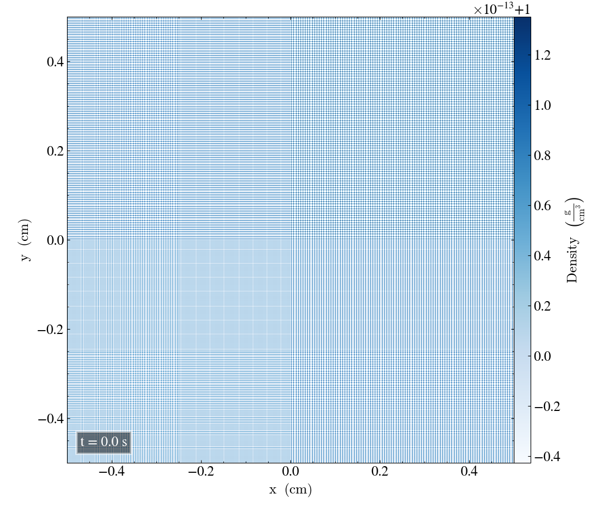
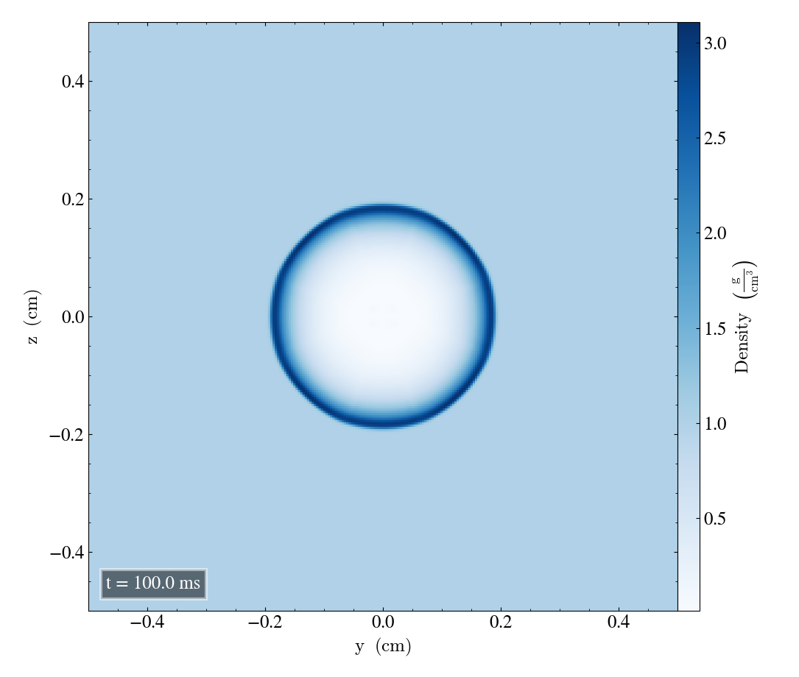
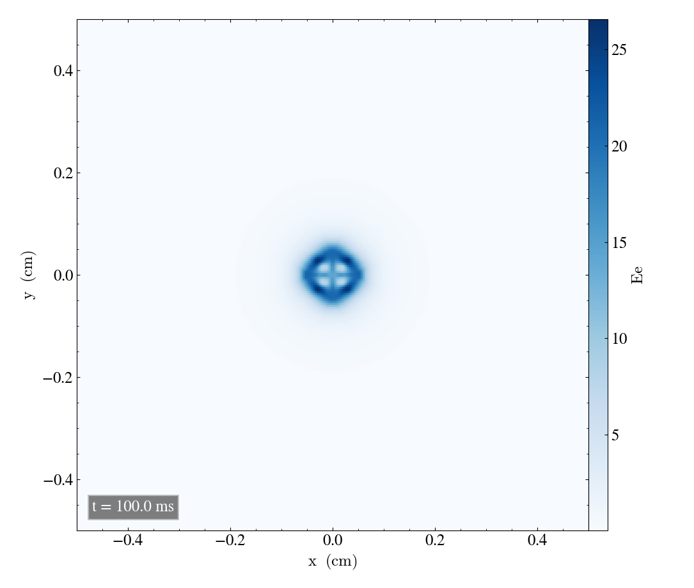
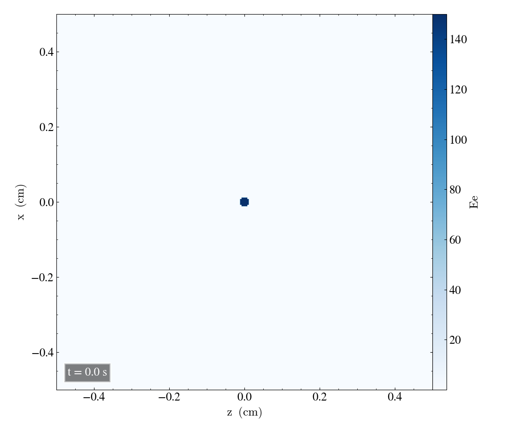
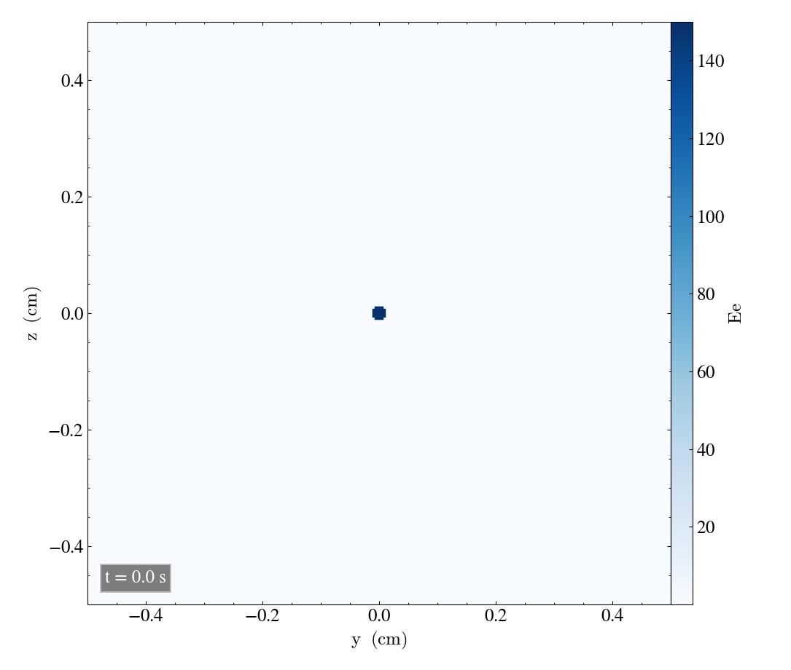
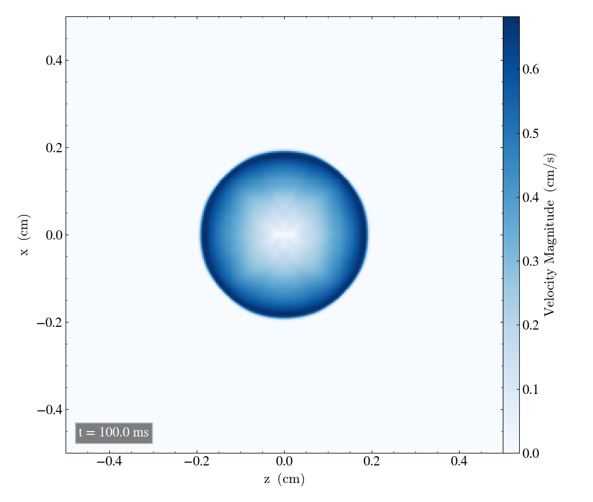
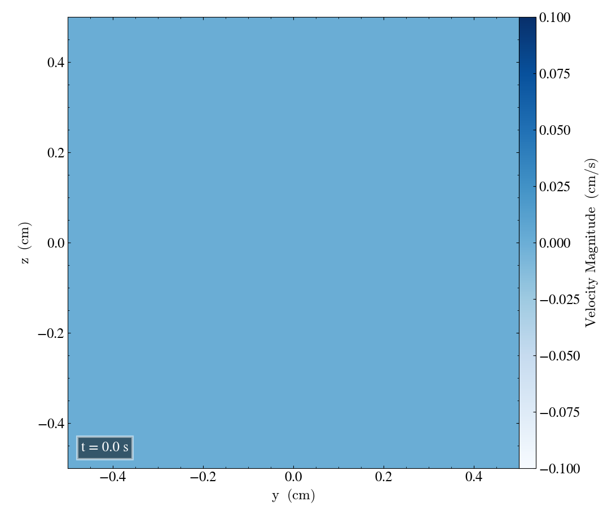

Sedov-Taylor experiment
=======================

Here we will report the results of the Sedov-Taylor experiment

Bifrost solver
--------------
First we are going to look at the Sedov problem using the Bifrost solver.

Parameters and initial conditions
----------------------------------
For the Sod problem we use
       * gamma = 1.4
       * Final time = 0,2
Below shows a table of the inital conditions for the left state and right state. These values will be used in all verifications for the Sod problem including the Bifrost solver and Ramses/mhd_eos solver.

* r0 = 0.0125
* centre = 0.0, 0.0, 0.0

+----------------------------------------------+
|              experiment_params               |
+==============+==============+================+
|  Quantities  |    Inside    |    Outside     |
+--------------+--------------+----------------+
|      d0      |     1.0      |     1.0        |
+--------------+--------------+----------------+
|      p0      |     0.01     |     100        |
+--------------+--------------+----------------+
|     bx0      |      0       |      0         |
+--------------+--------------+----------------+
|     by0      |      0       |      0         |
+--------------+--------------+----------------+
|     bz0      |      0       |      0         |
+--------------+--------------+----------------+

+-----------------------------------+
|           output_params           |           
+===========+==========+============+
|  end_time | out_time | print_time |
+-----------+----------+------------+
|    0.1    |   1e-2   |     0      | 
+-----------+----------+------------+

+------------------------------------------------------+
|             cartesian_params (xy-case = 2)           |
+==========+=======+===========+=============+=========+
|   size   |  dims |  mpi_dims |    origin   | periodic|
+----------+-------+-----------+-------------+---------+
| 1,1,0.004| 8,8,1 |   2,2,1   | -0.5,-0.5,0 |  f,f,t  |
+----------+-------+-----------+-------------+---------+

+-------------------------------------------------+
|          patch_params (xy-case = 2)             |
+=========+===============+========+==============+
|    n    |  do_check_nan |  grace | no_mans_land | 
+---------+---------------+--------+--------------+
| 32,32,1 |       t       |   0.1  |      t       |
+---------+---------------+--------+--------------+

+------------------------------------+
|     Initial Bifrost parameters:    |
+======+=====+=====+=====+=====+=====+
|  Ca  |  U  |  Uv |  d  |  e  |  E  |
+------+-----+-----+-----+-----+-----+
| 0.03 | 0.3 | 0.1 | 0.05| 0.05| 0.9 |
+------+-----+-----+-----+-----+-----+

The initial Bifrost parameters for the Sedov-problem are presented in the table above. During test verifications we will work on the follwing
   * branch: develop
   * commit message hash: 

When using the Bifrost solver we are going to change the initial Bifrost parameters one at a time, while holding the other parameters constant.

Density, energy and velocity in all planes
------------------------------------------
Below shows the initial and final snapshot of the density in all 3 planes.

Density
-------
First for the xy-plane:

Then for the xz-plane:

.. image:: images_sedov_bifrost/density_sedov_bifrost_xz_0.png
    :scale: 40 %
    :width: 100 %

And lastly for yz-plane

Energy
------
xy:

xz:

yz:

Velocity magnitude
------------------
xy:

.. image:: images_sedov_bifrost/velocity_magnitude_sedov_bifrost_xy_0.png
    :scale: 40 %
    :width: 100 %

xz:

yz:

 
