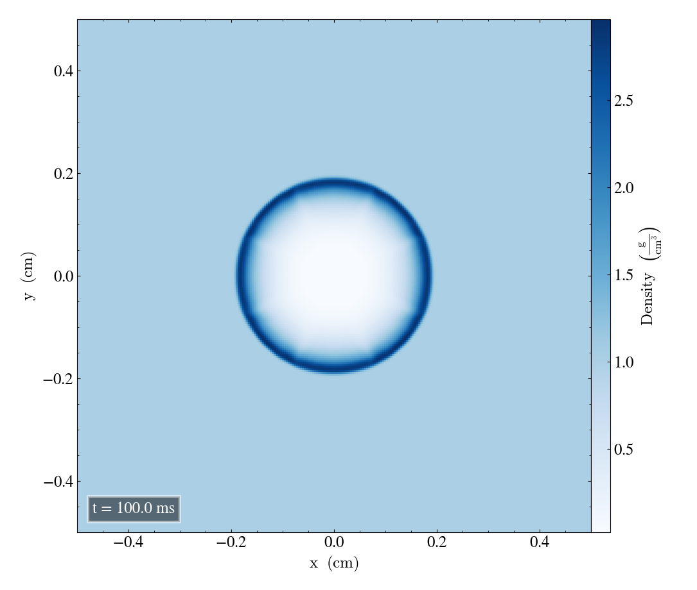
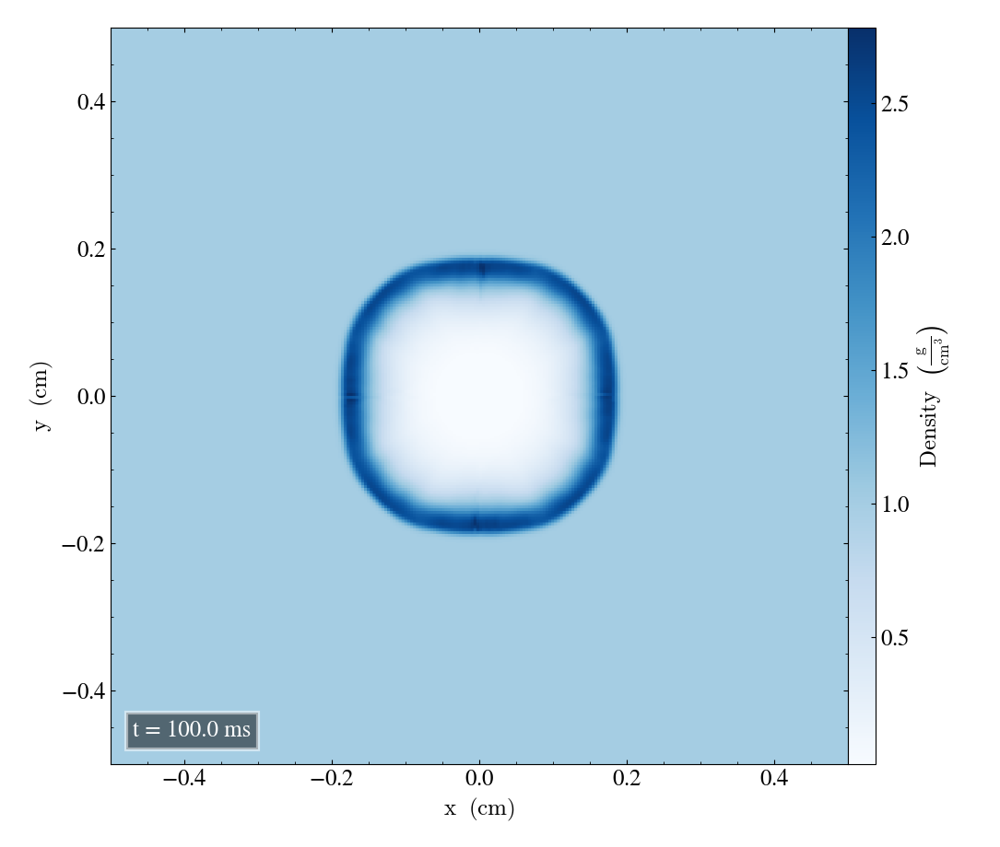
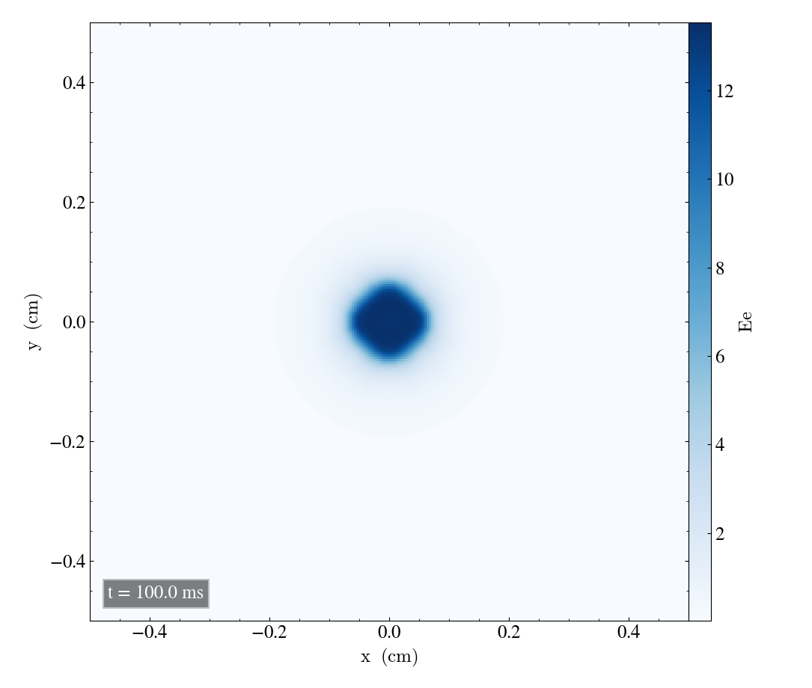

Sedov-Taylor experiment
=======================

Here we will report the results of the Sedov-Taylor experiment

Bifrost solver
--------------
First we are going to look at the Sedov problem using the Bifrost solver.

Parameters and initial conditions
----------------------------------
For the Sedov problem we use
       * gamma =´5/3
 
Below shows a table of the inital conditions for the inside and outside of the blast. These values will be used in all verifications for the Sedov problem: In addition we have the following parameters

* r0 = 0.0125
* centre = 0.0, 0.0, 0.0

+----------------------------------------------+
|              experiment_params               |
+==============+==============+================+
|  Quantities  |    Inside    |    Outside     |
+--------------+--------------+----------------+
|      d0      |     1.0      |     1.0        |
+--------------+--------------+----------------+
|      p0      |     0.01     |     100        |
+--------------+--------------+----------------+
|     bx0      |      0       |      0         |
+--------------+--------------+----------------+
|     by0      |      0       |      0         |
+--------------+--------------+----------------+
|     bz0      |      0       |      0         |
+--------------+--------------+----------------+

Below shows output_params including end_time, out_time and print_time.

+-----------------------------------+
|           output_params           |           
+===========+==========+============+
|  end_time | out_time | print_time |
+-----------+----------+------------+
|    0.1    |   1e-2   |     0      | 
+-----------+----------+------------+

The two follwing tables shows cartesian_params and patch_params for case = 2 (xy-plane). For case = 3 (xz-plane) and case = 4 (yz-plane) the tables below will look almost identical, except changing the order of every number so that it corresponds to the given case/plane you are looking at.

For xy-plane we see that the first two numbers in size, dims, mpi_dims, origin and periodic is the same, but if you were to change into for instance xz-plane, then the x and z components would be the same but the y-component would be different in the same way as in the tables below:

+------------------------------------------------------+
|             cartesian_params (xy-case = 2)           |
+==========+=======+===========+=============+=========+
|   size   |  dims |  mpi_dims |    origin   | periodic|
+----------+-------+-----------+-------------+---------+
| 1,1,0.004| 8,8,1 |   2,2,1   | -0.5,-0.5,0 |  f,f,t  |
+----------+-------+-----------+-------------+---------+

+-------------------------------------------------+
|          patch_params (xy-case = 2)             |
+=========+===============+========+==============+
|    n    |  do_check_nan |  grace | no_mans_land | 
+---------+---------------+--------+--------------+
| 32,32,1 |       t       |   0.1  |      t       |
+---------+---------------+--------+--------------+

+------------------------------------+
|     Initial Bifrost parameters:    |
+======+=====+=====+=====+=====+=====+
|  Ca  |  U  |  Uv |  d  |  e  |  E  |
+------+-----+-----+-----+-----+-----+
| 0.03 | 0.3 | 0.1 | 0.05| 0.05| 0.9 |
+------+-----+-----+-----+-----+-----+

The initial Bifrost parameters for the Sedov-problem are presented in the table above. During test verifications we will work on the following
   * branch: develop
   * commit message hash: 5e8f853 

When using the Bifrost solver we are going to change the initial Bifrost parameters one at a time, while holding the other parameters constant.

Density, energy and velocity in all planes
------------------------------------------
Below shows the initial and final snapshots of the density in xy-plane (case = 2), xz-plane (case = 3) and yz-plane (case = 4). All initial Bifrost parameters that are used, are unchanged and are given by the table above.

Density for xy, xz and yz
---------------------------
First for the xy-plane:

Then for the xz-plane:

.. image:: images_sedov_bifrost/density_sedov_bifrost_xz_0.png
    :width: 48 %
.. image:: images_sedov_bifrost/density_sedov_bifrost_xz_10.png
    :width: 48 %

And lastly for yz-plane

.. image:: images_sedov_bifrost/density_sedov_bifrost_yz_0.png
    :width: 48 %
.. image:: images_sedov_bifrost/density_sedov_bifrost_xz_10.png
    :width: 48 %

And lastly for yz-plane

.. image:: images_sedov_bifrost/density_sedov_bifrost_yz_0.png
    :width: 48 %
.. image:: images_sedov_bifrost/density_sedov_bifrost_yz_10.png
    :width: 48 %

Energy for xy, xz and yz
-------------------------
First for the xy-plane:

.. image:: images_sedov_bifrost/ee_sedov_bifrost_xy_0.png
    :width: 48 %

Then for the xz-plane:

.. image:: images_sedov_bifrost/ee_sedov_bifrost_xz_10.png
    :width: 48 %

And lastly for yz-plane:

.. image:: images_sedov_bifrost/ee_sedov_bifrost_yz_0.png
    :width: 48 %
.. image:: images_sedov_bifrost/ee_sedov_bifrost_yz_10.png
    :width: 48 %

Velocity magnitude for xy, xz and yz
-------------------------------------
First for the xy-plane:

.. image:: images_sedov_bifrost/velocity_magnitude_sedov_bifrost_xy_0.png
    :width: 48 %
.. image:: images_sedov_bifrost/velocity_magnitude_sedov_bifrost_xy_10.png
    :width: 48 %

Then for the xz-plane:

.. image:: images_sedov_bifrost/velocity_magnitude_sedov_bifrost_xz_0.png
    :width: 48 %

And lastly for yz-plane:

.. image:: images_sedov_bifrost/velocity_magnitude_sedov_bifrost_yz_0.png
    :width: 48 %
.. image:: images_sedov_bifrost/velocity_magnitude_sedov_bifrost_yz_10.png
    :width: 48 %

Addjusting Bifrost parameters
-----------------------------
Every image on the left side is the given quantity in the xy-plane with unadjusted Bifrost parameters.

Addjusted density
------------------
Right image is Ca increased by a factor of 10:

Right image is U increased by a factor of 10:

Right image is U reduced by a factor of 10:

.. image:: images_sedov_bifrost/density_sedov_bifrost_xy_decrease10_U_10.png
    :width: 48 %

Addjusted energy
-----------------
Right image is parameter Ca increased (first line) by a factor of 10 and then Ca reduced (second line) by a factor of 10:

Right image is parameter U increased (first line) by a factor of 10 and then U reduced (second line) by a factor of 10:

.. image:: images_sedov_bifrost/ee_sedov_bifrost_xy_increase10_U_10.png
    :width: 48 %

.. image:: images_sedov_bifrost/ee_sedov_bifrost_xy_decrease10_U_10.png
    :width: 48 %

Right image is parameter d increased by a factor of 10:

Right image is parameter e increased by a factor of 10:

Addjusted velocity magnitude
----------------------------

Right image is parameter Ca reduced by a factor of 10:

.. image:: images_sedov_bifrost/velocity_magnitude_sedov_bifrost_xy_10.png
    :width: 48 %
.. image:: images_sedov_bifrost/velocity_magnitude_sedov_bifrost_xy_decrease10_Ca_10.png
    :width: 48 %

Right image is parameter U increased (first line) by a factor of 10 and then U reduced (second line) by a factor of 10:

.. image:: images_sedov_bifrost/velocity_magnitude_sedov_bifrost_xy_10.png
    :width: 48 %
.. image:: images_sedov_bifrost/velocity_magnitude_sedov_bifrost_xy_increase10_U_10.png
    :width: 48 %

.. image:: images_sedov_bifrost/velocity_magnitude_sedov_bifrost_xy_10.png
    :width: 48 %
.. image:: images_sedov_bifrost/velocity_magnitude_sedov_bifrost_xy_decrease10_U_10.png
    :width: 48 %

Right image is parameter d increased by a factor of 10:

.. image:: images_sedov_bifrost/velocity_magnitude_sedov_bifrost_xy_10.png
    :width: 48 %
.. image:: images_sedov_bifrost/velocity_magnitude_sedov_bifrost_xy_increase10_d_10.png
    :width: 48 %

Right image is parameter Uv increased by a factor of 10:

.. image:: images_sedov_bifrost/velocity_magnitude_sedov_bifrost_xy_10.png
    :width: 48 %

