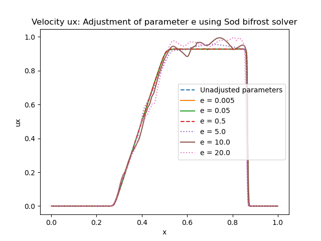
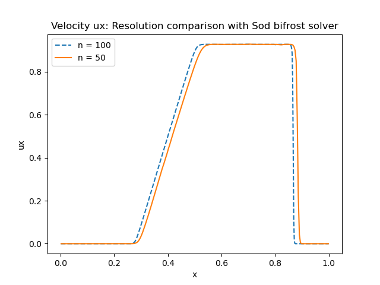
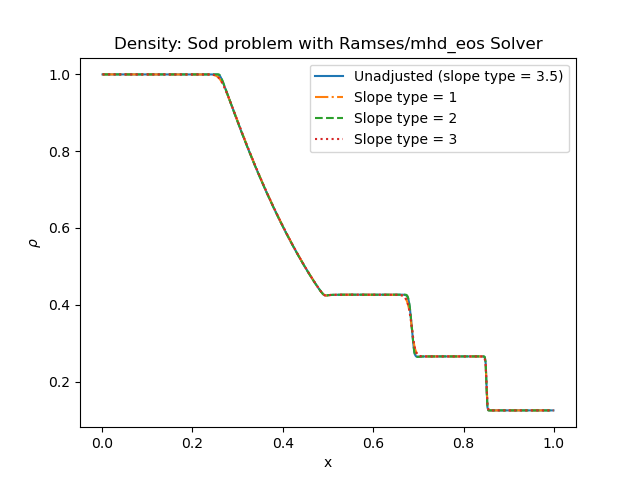

Sod experimemts 
================

Here we will report the results of the Sod experiment 

Bifrost solver
===============
First we are going to study the Sod experiment with the use of the Bifrost solver, that uses the initialBifrost parameters presented in the second table below.

Initial conditions
------------------
For the Sod problem we use
       * gamma = 1.4
       * Final time = 0,2 
Below shows a table of the inital conditions for the left state and right state. These values will be used in all verifications for the Sod problem including the Bifrost solver and Ramses/mhd_eos solver.

+--------------+--------------+----------------+
|  Quantities  |  Left state  |  Right state   |
+==============+==============+================+
|     rho      |      1       |    0.125       |
+--------------+--------------+----------------+
|      p       |      1       |     0.1        |
+--------------+--------------+----------------+
|     vx       |      0       |      0         |
+--------------+--------------+----------------+
|     vy       |      0       |      0         |
+--------------+--------------+----------------+
|     vz       |      0       |      0         |
+--------------+--------------+----------------+
|     bx       |      0       |      0         |
+--------------+--------------+----------------+
|     by       |      0       |      0         |
+--------------+--------------+----------------+
|     bz       |      0       |      0         |
+--------------+--------------+----------------+

+------------------------------------+
|     Initial Bifrost parameters:    |
+======+=====+=====+=====+=====+=====+
|  Ca  |  U  |  Uv |  d  |  e  |  E  |
+------+-----+-----+-----+-----+-----+
| 0.01 | 0.3 | 0.1 | 0.5 | 0.5 | 0.9 |
+------+-----+-----+-----+-----+-----+

The initial Bifrost parameters for the Sod-problem are presented in the table above. During test verifications for the Bifrost solver below, we are going to change these parameters one at a time, while holding the other parameters constant.

Density for all directions (Bifrost solver)
--------------------------------------------
To verify that the experiment for the Sod problem is working as it should, we plot the density for every direction x,y and z. If the code works, all three densities should behave the same. 

.. image:: images_sod_bifrost/sod_bifrost_xyz_rho.png

As we can see from the figure above, all three denisty curves lie on top of eachother.

Adjusting all bifrost parameters (Bifrost solver)
-------------------------------------------------
The main part of our verification on the Sod Bifrost problem begins now where we want to change the initial bifrost parameters that are presented in the table above. To see how the different parameters affect the results, we change only one Bifrost parameter at a time while holding the other parameters unchanged.

Below shows the density in x direction, where each curve represent the density in which one of the initial Bifrost parameters is either increased (Left figure) or decreased (Right figure):
       

.. image:: images_sod_bifrost/sod_bifrost_x_decrease10_rho.png
    :scale: 70 %
    :width: 70 %

Below shows the horizontal velocity ux in x direction, where each curve represent the velocity in which one of the initial Bifrost parameters is either increased (Left figure) or decreased (Right figure):            

.. image:: images_sod_bifrost/sod_bifrost_x_increase10_ux.png
    :scale: 70 %
    :width: 70 %
.. image:: images_sod_bifrost/sod_bifrost_x_decrease10_ux.png
    :scale: 70 %
    :width: 70 %

Adjusting a single bifrost parameter (Bifrost solver)
-----------------------------------------------------
From the results we got when addjusting all parameters, we found that only the parameters
       * U
       * d
       * e
affected the different plots. We now want to study these parameters specifically by plotting density, velocity and pressure for several values of the same parameter, while holding the others unchanged.

Below shows density in x direction and horizontal velocity, plotted for 6 different values of U: 

.. image:: images_sod_bifrost/sod_bifrost_x_single_param_adjust_U_ux.png

Next we have the same results for 6 different values of d:

.. image:: images_sod_bifrost/sod_bifrost_x_single_param_adjust_d_rho.png

.. image:: images_sod_bifrost/sod_bifrost_x_single_param_adjust_d_ux.png

And last but not least we have density and velocity for 6 different values of the e parameter:

Resolution comparison (Bifrost solver)
--------------------------------------
In all previous verifications for the Sod problem in the x-direction, we have splitted the x-axis in 5 different parts (dims = 5). For each part we divided the grid in n = 100 (&patch_params in the nml-file). Now we want to decrease the resolution to n = 50 and compare results with n = 100 for density, velocity and pressure.

.. image:: images_sod_bifrost/sod_bifrost_x_res_comparison_n50_n100_rho.png

Ramses/mhd_eos solver
=====================
Now we want to study the same Sod experiment with the use of Ramses/mhd_eos solver. Here we want to analyze the density rho and hoizontal velocity ux in x-direction for different slope type parameters (&ramses_params). The default/unadjusted slope type parameter is
   * Unadjusted slope_type = 3.5

During the use of the this particular solver we discovered and error in the Ramsese/mhd_eos solver whichwas later fixed. All the results below were produced with:
   * Branch = develop
   * Commit message hash: 5e8f853

Density for all directions (Ramses/mhd_eos solver) 
--------------------------------------------------
We do the same verification as for the bifrost solver, by plotting the density for every direction x,y and z. If the code works, all three densities should behave the same.

As we can see from the figure above, all three denisty curves lie on top of eachother.

Adjusting slope type parameter (Ramses/mhd_eos solver)
------------------------------------------------------
We addjust the slope type parameter by the following numbers
   * slope_type1 = 1
   * slope_type2 = 2
   * slope_type3 = 3

and plot the density rho and horizontal velocity ux in the x direction below:

Resolution comparison (Ramses/mhd_eos solver)
----------------------------------------------
Now we want to decrease the resolution to n = 50 and compare results with n = 100 for density and velocity.

