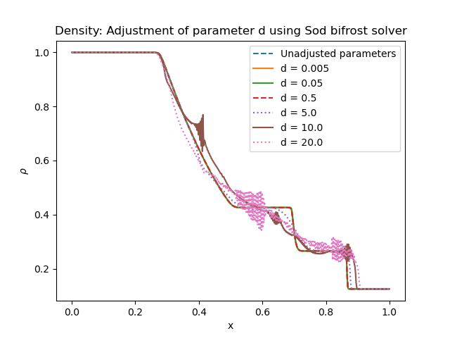
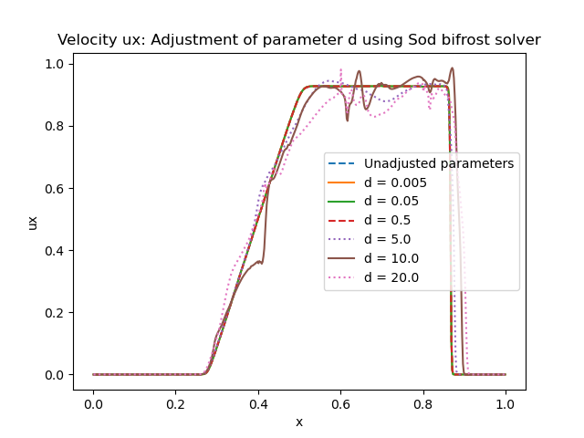

Sod experimemts 
================

Here we will report the results of the Sod experiment 

Initial conditions
------------------
For the Sod problem we use
       * gamma = 1.4
       * Final time = 0,2 
Below shows a table of the inital conditions for the left state and right state. These values will be used in all verifications for the Sod problem.

+--------------+--------------+----------------+
|  Quantities  |  Left state  |  Right state   |
+==============+==============+================+
|     rho      |      1       |    0.125       |
+--------------+--------------+----------------+
|      p       |      1       |     0.1        |
+--------------+--------------+----------------+
|     vx       |      0       |      0         |
+--------------+--------------+----------------+
|     vy       |      0       |      0         |
+--------------+--------------+----------------+
|     vz       |      0       |      0         |
+--------------+--------------+----------------+
|     bx       |      0       |      0         |
+--------------+--------------+----------------+
|     by       |      0       |      0         |
+--------------+--------------+----------------+
|     bz       |      0       |      0         |
+--------------+--------------+----------------+

+------------------------------------+
|     Initial Bifrost parameters:    |
+======+=====+=====+=====+=====+=====+
|  Ca  |  U  |  Uv |  d  |  e  |  E  |
+------+-----+-----+-----+-----+-----+
| 0.01 | 0.3 | 0.1 | 0.5 | 0.5 | 0.9 |
+------+-----+-----+-----+-----+-----+

The initial Bifrost parameters for the Sod-problem are presented in the table above. During test verifications we are going to change these parameters one at a time, while holding the other parameters constant.

Density for all directions
--------------------------

.. image:: images_sod_bifrost/sod_bifrost_xyz_rho.png

Adjusting all initial bifrost parameters
----------------------------------------
       
.. image:: images_sod_bifrost/sod_bifrost_x_increase10_rho.png
    :scale: 70 %
    :width: 70 %
.. image:: images_sod_bifrost/sod_bifrost_x_decrease10_rho.png
    :scale: 70 %
    :width: 70 %

Velocity plotted below:     

.. image:: images_sod_bifrost/sod_bifrost_x_increase10_ux.png
    :scale: 70 %
    :width: 70 %
.. image:: images_sod_bifrost/sod_bifrost_x_decrease10_ux.png
    :scale: 70 %
    :width: 70 %

Adjusting a single initial bifrost parameter
---------------------------------------------

.. image:: images_sod_bifrost/sod_bifrost_x_single_param_adjust_U_rho.png

.. image:: images_sod_bifrost/sod_bifrost_x_single_param_adjust_U_ux.png

.. image:: images_sod_bifrost/sod_bifrost_x_single_param_adjust_e_rho.png

.. image:: images_sod_bifrost/sod_bifrost_x_single_param_adjust_e_ux.png

   

